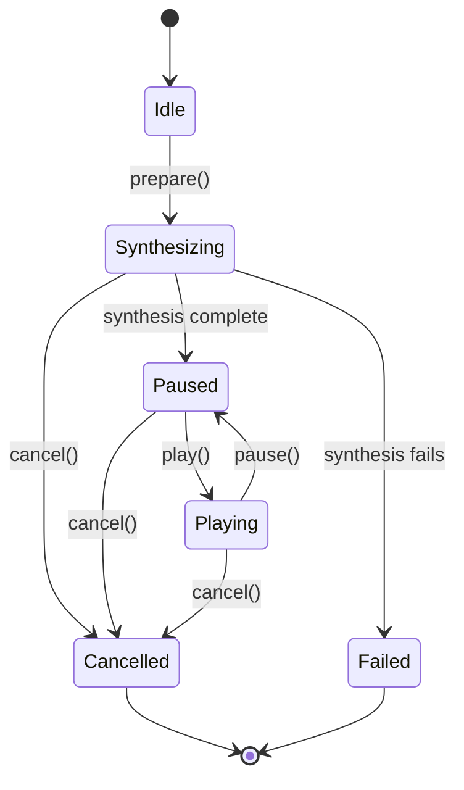

# BackgroundPlayer

## Overview

BackgroundPlayer orchestrates minimally interactive user listening of the current SuttaCard.
Its primary function is to enable a graceful transition from foreground to
background playback when the iOS lock screen appears.

There are two user interfaces (UIs) for BackgroundPlayer.1
The application BackgroundPlayerView implements the foreground UI and is also used to develop and debug the BackgroundPlayer API.
The iOS system defines and implements the lock screen UI, which the application cannot modify 
directly.
These two UI views are functionally the same, although the BackgroundPlayerView may expose additional functionality. 
Neither BackgrouldPlayer UI is as richly interactive as the SuttaPlayer/SuttaCardView combination.

## User Stories

### User selects Background Playback from Play context menu

User long-presses play icon in SuttaCardView to bring up the Play Menu and selects Background Playback

#### Synthesis UX 
User sees full-screen modal dialog with synthesis circular progress bar and relevant synthesis information polled at regular intervals of 0.5s.
User sees a close (X) button while synthesis is in progress.
The close button will close the modal dialog,
terminate synthesis and return to normal SuttaCardView UX.

Although synthesis  may take minutes, fully pre-cached audio will process in milliseconds.
Once synthesis is done, the modal dialog UX switches to Background Playback mode

#### Playback UX

During playback, the lock screen may or may not be active.
The iOS media player is only available in when the screen is locked.
When the screen is not locked, the app is responsible for media playback UX.

* Close (X icon)
* Play/Pause button similar to SuttaCardView Play/Pause button
* "<" and ">" icon buttons for section navigation
* Current segment scid
* Current segment text (scrollable?)
* horizontal linear progress bar progress segment playback progress

User hears audio as for SuttaPlayer, starting with the current segment determined at the 
time the user initiated background playback.

### BackgroundPlayer Phases

BackgroundPlayer orchestrates synthesis and playback as two phases:

**Synthesis phase**: Modal dialog visible only while app is foreground. If user backgrounds app during synthesis:
- Modal disappears
- Synthesis halts (AVSpeechSynthesizer unavailable in background per BackgroundAudio.md)
- User has no way to monitor synthesis progress
- User can only re-enter app to resume or check status

**Playback phase**: Modal can be dismissed when app backgrounds:
- AVAudioPlayer continues playback via background audio session
- User controls playback via lock screen (play/pause, next/previous segment)
- Lock screen shows sutta title, current segment info, elapsed time, artwork
- No custom UI available; system controls presentation

## API
### Initialization

```swift
init(suttaRef: SuttaRef, audioContext: AudioContext? = nil, audioStore: AudioStore = .shared)
```

- `suttaRef`: Sutta to play
- `audioContext`: Optional customization for testing
- `audioStore`: Optional dependency injection for testing

### Initialization
The BackgroundPlayer.init() method is synchronous and fast.
However, further initialization is required.
In particular, the segments associated with the suttaRef must be loaded
and synthesized prior to playback.

```swift
func prepare() async throws -> PlaybackSnapshot
```

The prepare() method initialzes the BackgroundPlayer and
delegates full segment synthesis to AudioSynthesisSession.
It returns when the BackgroundPlayer is ready for playback.

### Cancellation
Cancellation is only available from foreground UI.

```swift
func cancel()       // Cancel synthesis and playback
```

### Playback Control

The following methods will throw an error if Background Player is not in .playback state

```swift
func play()         // Start playback from current segment
func pause()        // Pause playback
func playNext()     // Pause and start playback from next segment
func playPrevious() // If paused or elapsed playtime < 1s, pause and start playback from previous segment, otherwise pause and start playback of current segment
```

## PlayerState 

```swift
enum PlayerState {
  case idle             // Initial state
  case synthesizing     // Synthesis: synthesizing, playback blocked
  case paused           // Playback1: synthesis complete, paused and ready to play
  case playing          // Playback2: synthesis complete, playback in progress
  case cancelled        // Final1: Synthesis and playback cancelled
  case failed(String)   // Final2: Synthesis or playback failed
}
```swift



### Observables

```swift
struct PlaybackSnapshot {
  let suttaRef: SuttaRef                // current segment scid
  let segment: Segment                  // current segment
  let segmentIndex: Int                 // 0-based current segment index
  let totalSegments: Int                // number of segments in sutta
  let playbackDuration:TimeInterval     // as for MPMediaItemPropertyPlaybackDuration
  let elapsedPlaybackTime:TimeInterval  // as for MPNowPlayingInfoPropertyElapsedPlaybackTime
  let trackTitle: String                // as for MPMediaItemPropertyTitle
  let artist:String                     // as for MPMediaItemPropertyArtist
}

@Published var state: PlayerState                  // Current playback state
@Published var synthesisSnapshot: SessionSnapshot? // synthesis info
@Published var playbackSnapshot: PlaybackSnapshot? // playback info
```

### Lock Screen Integration

The iOS lockscreen provides status and command interfaces for application.

#### Lock Screen Status
The iOS system controls lock screen playback UX and the application
simply provides metadata via MP properties:

| MP Property | Value
| :---- | :----
| MPMediaItemPropertyArtwork:UIImage? | Cover artwork for lock screen 
| MPMediaItemPropertyTitle:String | .scid followed by text ("MN8:1.1 So I have hea...")
| MPMediaItemPropertyArtist:String | translator name ("Bhikkhu Sujato")
| MPMediaItemPropertyAlbumTitle:String | sutta title ("Discourse on Right View")
| MPMediaItemPropertyPlaybackDuration:TimeInterval | audio file duration  
| MPNowPlayingInfoPropertyElapsedPlaybackTime:TimeInterval | track elapsedTime
| MPMediaItemPropertyLyrics | (not applicable)

#### Lock Screen Commands
For playback commands, the Background Player will respond via handlers to:

* play: play from current segment
* pause; pause play of current segment
* playNext: advance to next segment and play
* playPrevious: pause play immediately. if playback time of current segment was <1s, restart play at previous segment, otherwise restart play of current segment

## Open Questions

### App Background/Foreground Transitions

**Scenario**: Playback active, user switches to another app

**Expected**:
- Playback continues uninterrupted via AVAudioPlayer (background audio modes)
- Synthesis halts (AVSpeechSynthesizer unavailable in background per BackgroundAudio.md constraint)
- Lock screen remains responsive
- When app returns to foreground, synthesis resumes from next uncached segment

**Scenario**: Synthesis in progress, user backgrounded app

**Expected**:
- Synthesis halts immediately (AVSpeechSynthesizer stops)
- AVAudioPlayer continues playback of already-synthesized segments
- Playback of remaining uncached segments stalls until app returns to foreground
- When app foregrounds, synthesis resumes automatically (next call to synthesize next uncached segment)

## References

- `scv-ui/Sources/scvUI/BackgroundPlayer.swift` — Core implementation
- `doc/AudioSynthesisSession.md` — Pre-caching
- `doc/BackgroundAudio.md` — Audio constraints
- `doc/SuttaPlayer.md` — Interactive foreground playback

