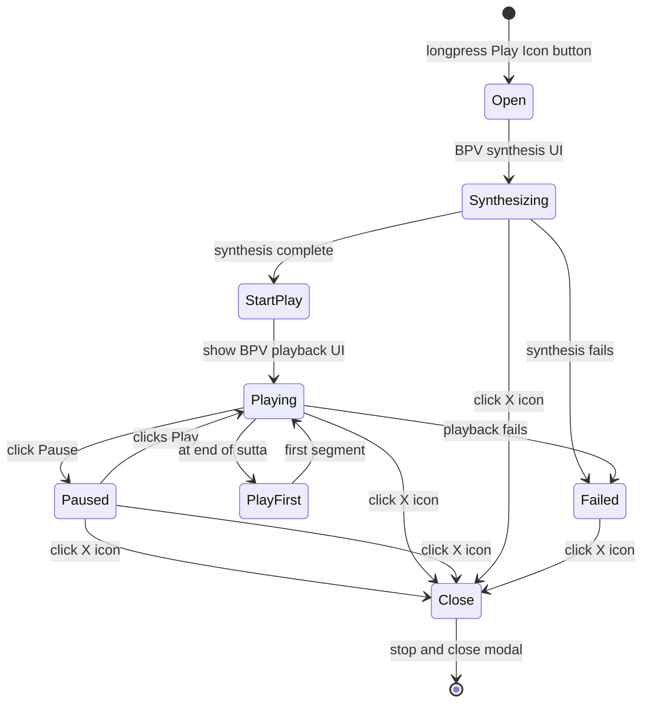

# BackgroundPlayerView

## User Story

As a user of SuttaCardView,
I want to long-press the play button and select "Background Playback"
So that I can listen to audio for the current SuttaCard document starting at the current segment.

SuttaCardView main task is to support highly interactive foreground playback.
However, I also need a minimally interactive background playback that can transition to the iOS lockscreen without interrupting playback.
The default foreground playback uses synthesis on demand for the best user experience (UX).
Background playback, in contrast, cannot use synthesis on demand since synthesis is not permitted when the screen is locked.
For this reason, we need to create a BackgroundPlayerView (BPV) with a different UX.

The BackgroundPlayerView has two modes presenting: synthesis UI, playback UI.
Synthesis UI is read-only and simply presents the existing Background Playback modal from SuttaCardView.
With synthesis complete, BPV switches to playback mode, presenting a minimal UI
that is functionally equivalent to the lock screen audio-playback UI.
In both modes, BackgroundPlayerView relies on BackgroundPlayer instance as its model.

The lock screen is not allowed during synthesis. However, it is allowed playback mode.

Finally, the user may cancel background synthesis/playback at any time by simply closing the BackgroundPlayerView.




## Architecture

### Component Structure

```
BackgroundPlayerView
  ├─ @ObservedObject var player: BackgroundPlayer
  ├─ @Binding var isPresented: Bool
  ├─ let themeProvider: ThemeProvider
  │
  ├─ Synthesis Phase
  │  ├─ Progress modal (circular indicator)
  │  ├─ currentStep/totalSteps display
  │  ├─ State description (synthesizing/completed/failed)
  │  ├─ Time remaining estimate
  │  ├─ Cancel button (during synthesis)
  │  └─ Done button (after synthesis)
  │
  └─ Playback Phase
     ├─ Play/Pause button
     ├─ Previous/Next segment buttons
     ├─ Current segment display (scid + text)
     ├─ Horizontal progress bar
     └─ Close (X) button
```

### Synthesis Phase Details

**State observation:**
- Observes `player.state` (PlaybackState enum)
- Observes `player.synthesisSnapshot` (SessionSnapshot? for progress details)

**Polling mechanism:**
- Synthesis phase uses polling (~0.5s intervals) per SuttaCardView.md:108-122
- No callbacks needed; simpler than event-based approach
- Fresh data always available on main thread
- Task-based polling with cancellation support

**UI transitions:**
- `.idle` → `.synthesizing`: show progress modal
- `.synthesizing` → `.completed`: show Done button, allow dismissal
- `.synthesizing` → `.failed`: show error, allow dismissal
- `.synthesizing` → `.cancelled`: auto-dismiss (user closed modal)

### Playback Phase Details

**State observation:**
- Observes `player.state` (PlaybackState: playing, paused, done, failed)
- Observes `player.playbackSnapshot` (PlaybackSnapshot for segment/timing info)

**UI behavior:**
- Play/Pause button reflects current state
- Prev/Next buttons navigate segments
- Horizontal progress bar shows currentTime/duration
- Lock screen UI equivalent (minimal, no complex gestures)

**Controls:**
- Play: `player.play()`
- Pause: `player.pause()`
- Previous: `player.playPrevious()`
- Next: `player.playNext()`
- Cancel: `player.cancel()` → close modal

## API

```swift
struct BackgroundPlayerView: View {
  @ObservedObject var player: BackgroundPlayer
  @Binding var isPresented: Bool
  let themeProvider: ThemeProvider

  var body: some View { ... }
}
```

**Parameters:**
- `player`: BackgroundPlayer instance (model for synthesis/playback)
  - Type: @ObservedObject (observable, triggers refresh on @Published changes)
  - Expected states: idle → synthesizing → [completed/failed/cancelled] or synthesizing → [paused/playing/failed]
- `isPresented`: Binding to modal visibility (controlled by parent SuttaCardView)
  - Updated by: Close button, Done button, swipe-to-dismiss
- `themeProvider`: ThemeProvider for colors and styling
  - Type: @EnvironmentObject (available from SwiftUI environment)

**Observables from BackgroundPlayer:**
- `state: PlaybackState` — Current state (triggers phase transition)
- `synthesisSnapshot: SessionSnapshot?` — Progress details (synthesis phase)
- `playbackSnapshot: PlaybackSnapshot?` — Playback details (playback phase)

## Integration with SuttaCardView

### Current Implementation (Before)

SuttaCardView embeds synthesis progress UI:
```swift
@State private var backgroundSession: AudioSynthesisSession?
@State private var showSynthesisModal = false

.contextMenu {
  Button(action: startSynthesis) { ... }
}

private func startSynthesis() {
  let suttaRef = SuttaRef.create(card.suttaReference)
  backgroundSession = AudioSynthesisSession(suttaRef)
  showSynthesisModal = true
  Task { await backgroundSession?.execute() }
}

.sheet(isPresented: $showSynthesisModal) {
  SynthesisProgressModal(session: backgroundSession)
}
```

**Problems:**
- 220+ lines of synthesis UI code embedded in SuttaCardView
- SynthesisProgressModal not reusable
- Hard to test synthesis progress UI independently
- Mixes concerns: view layout + synthesis orchestration

### New Implementation (After)

SuttaCardView uses BackgroundPlayerView:
```swift
@State private var backgroundPlayer: BackgroundPlayer?
@State private var showBackgroundPlayerView = false

.contextMenu {
  Button(action: startBackgroundPlayback) { ... }
}

private func startBackgroundPlayback() {
  guard let suttaRef = SuttaRef.create(card.suttaReference) else { return }
  let player = BackgroundPlayer(suttaRef: suttaRef)
  backgroundPlayer = player
  showBackgroundPlayerView = true

  Task {
    _ = try await player.prepare()
  }
}

.sheet(isPresented: $showBackgroundPlayerView) {
  if let player = backgroundPlayer {
    BackgroundPlayerView(
      player: player,
      isPresented: $showBackgroundPlayerView,
      themeProvider: themeProvider
    )
  }
}

.onDisappear {
  if player.currentSutta?.sutta_uid == card.mlDoc?.sutta_uid {
    player.pause()
    player.currentSutta = nil
  }
  Task {
    await backgroundPlayer?.cancel()
  }
}
```

**Benefits:**
- SuttaCardView: ~40 lines of background playback code (simple + testable)
- BackgroundPlayerView: encapsulates all UI logic (reusable + testable)
- Clean separation: model (BackgroundPlayer) vs view (BackgroundPlayerView)
- Synthesis progress UI can be tested independently

## Implementation Notes

### Threading & Concurrency

- BackgroundPlayerView: @MainActor (UI updates on main thread)
- BackgroundPlayer: @MainActor (state updates on main thread)
- Polling task: uses Task.sleep(nanoseconds:) from main thread
- No actor crossings needed; polling queries main thread properties

### Cleanup & Cancellation

BackgroundPlayerView cancels synthesis on disappear (if still synthesizing):
```swift
.onDisappear {
  Task {
    if case .synthesizing = player.state {
      player.cancel()
    }
  }
}
```

SuttaCardView also cancels if dismissed:
```swift
.onDisappear {
  Task {
    await backgroundPlayer?.cancel()
  }
}
```

### Error Handling

- Synthesis errors: SessionSnapshot.state = .failed(errorMsg)
- Playback errors: PlaybackState.failed(errorMsg)
- UI shows error state with message + Close button
- User can dismiss and retry

## References

- `doc/BackgroundPlayer.md` — Synthesis orchestration and playback API
- `doc/SuttaCardView.md` — Progress Monitoring Patterns (lines 108-122), Modal Progress Display (lines 126-147)
- `doc/AudioSynthesisSession.md` — Synthesis session actor and SessionSnapshot
