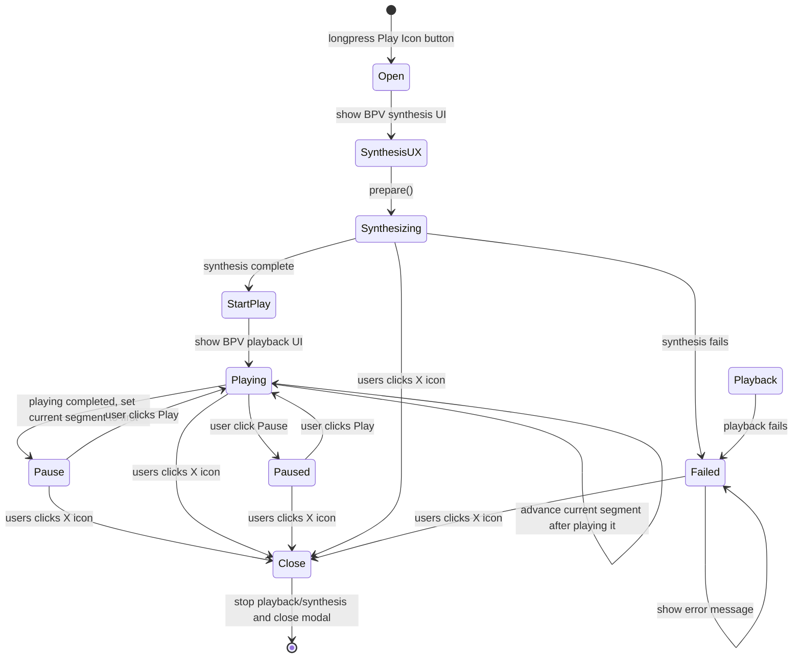

# BackgroundPlayerView

## User Story

As a user of SuttaCardView,
I want to long-press the play button and select "Background Playback"
So that I can listen to audio for the current SuttaCard document starting at the current segment.

SuttaCardView main task is to support highly interactive foreground playback.
However, I also need a minimally interactive background playback that can transition to the iOS lockscreen without interrupting playback.
The default foreground playback uses synthesis on demand for the best user experience (UX).
Background playback, in contrast, cannot use synthesis on demand since synthesis is not permitted when the screen is locked.
For this reason, we need to create a BackgroundPlayerView (BPV) with a different UX.

The BackgroundPlayerView has two modes presenting: synthesis UI, playback UI.
Synthesis UI is read-only and simply presents the existing Background Playback modal from SuttaCardView.
With synthesis complete, BPV switches to playback mode, presenting a minimal UI
that is functionally equivalent to the lock screen audio-playback UI.
In both modes, BackgroundPlayerView relies on BackgroundPlayer instance as its model.

The lock screen is not allowed during synthesis. However, it is allowed playback mode.

Finally, the user may cancel background synthesis/playback at any time by simply closing the BackgroundPlayerView.

